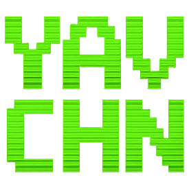

# YAVCHN - Yet Another Vibe-Coded Hacker News



A three-pane web reader for Hacker News:

- **Left:** paged list of stories
- **Right-top:** the linked article, reader-mode extracted
- **Right-bottom:** the HN discussion thread

Why?

Because I could!

## No, Really... Why?

It seems that everybody has their own personalized Hacker-News reader these days. After all, why not? It's so easy to whip one up in an evening when you have agentic coding at your disposal.

Whenever I browse Hacker News, I find myself opening the discussion in a new tab, then clicking through in that tab to view the article, then popping back to the discussion. It's all very annoying, when what I really want to do is get a quick overview of the article and see if there is any interesting discussion going on before I dive into either the article or the discussion.

YAVCHN lets me quickly browse an article in scaled-down reader mode in one pane and see the discussion in the pane below. If I find either one compelling, I can click "Open original" to see the original article or "Open on HN" to join the discussion on Hacker News.

## Live Site

The site is live at https://yavchn.parkscomputing.com/ if you'd like to try it out.

## Running Locally

```
go run ./src
```

Serves on `http://localhost:8080`.

## Stack

- Go 1.25, standard `net/http` + `html/template`.
- `golang.org/x/sync/singleflight` &mdash; coalesce concurrent upstream fetches.
- `github.com/hashicorp/golang-lru/v2/expirable` &mdash; bounded LRU + TTL for HN item and thread caches.
- `github.com/go-shiori/go-readability` &mdash; server-side article extraction.
- `github.com/microcosm-cc/bluemonday` &mdash; HTML sanitisation for extracted articles and comment bodies.
- `modernc.org/sqlite` &mdash; pure-Go SQLite for the article-extraction cache.
- Vanilla JS frontend, CSS grid layout. No SPA framework.

## Design notes

- **URL is king**: Every state is addressable: `/`, `/?page=N`, `/s/{hn-id}`, `/s/{hn-id}?page=N`.
- **Zero auth**: HN has no OAuth. Comments are fetched server-side from the HN Algolia API and rendered into the discussion pane. For vote / save / hide / reply, click the per-comment "&uarr;" or the pane-header "Open on HN &uarr;" to open the item on news.ycombinator.com in a new tab where your existing HN session handles the action. YAVCHN never sees your credentials or cookies.
- **Cache hierarchy**: HN top-list, items, and comment threads: in-memory LRU + TTL. Extracted articles: SQLite (expensive to recompute, but stable per URL).
- **Progressive enhancement**: Pages render server-side without JavaScript. Article reader-mode and discussion rendering are lazy-loaded after first paint via `GET /api/article?url=...` and `GET /api/discussion?id=...`; no-JS visitors get prominent "Open article" / "Open on HN" fallback links.
- **Persisted UI state**: Splitter sizes and the light/dark theme preference live in `localStorage`; an inline script in `<head>` applies them before first paint to avoid flash.

## Docker

```
docker build -t yavchn .
docker run --rm -p 8080:8080 yavchn
```

Single-binary distroless image. SQLite article cache lives at `/home/nonroot/yavchn.db` inside the container; rebuilds from scratch after a container replace.
