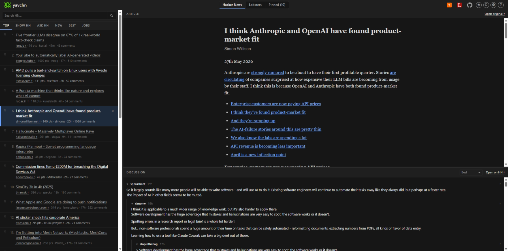

# YAVCHN - Yet Another Vibe-Coded Hacker News (Wrapper)


A three-pane web reader for Hacker News and [Lobsters](https://lobste.rs):

- **Left:** The list of articles from the active source
- **Right-top:** The linked article, reader-mode extracted
- **Right-bottom:** The discussion thread, server-rendered

Why?

Because I could!

## No, Really... Why?

It seems that everybody has their own personalized Hacker-News reader these days. After all, why not? It's so easy to whip one up in an evening when you have agentic coding at your disposal.

Whenever I browse HN, I find myself opening the discussion in a new tab, then clicking through in that tab to view the article, then popping back to the discussion. It's all very annoying, when what I really want to do is get a quick overview of the article and see if there is any interesting discussion going on before I dive into either the article or the discussion.

YAVCHN lets me quickly browse an article in scaled-down reader mode in one pane and see the discussion in the pane below. If I find either one compelling, I can click "Open original" to see the original article or "Open on HN" / "Open on Lobsters" to join the discussion on the source's own site.

The same three-pane treatment works on [Lobsters](https://lobste.rs) (a smaller, computing-focused link aggregator) thanks to a tiny `Source` abstraction in the Go backend; pick the source from the segmented control at the top of the header.



## Live Site

The site is live at https://yavchn.parkscomputing.com/ if you'd like to try it out.

## Running Locally

```
go run ./src
```

Serves on `http://localhost:8080`.

## Stack

- Go 1.25, standard `net/http` + `html/template`.
- `golang.org/x/sync/singleflight` &mdash; coalesce concurrent upstream fetches.
- `github.com/hashicorp/golang-lru/v2/expirable` &mdash; bounded LRU + TTL for HN item and thread caches.
- `github.com/go-shiori/go-readability` &mdash; server-side article extraction.
- `github.com/microcosm-cc/bluemonday` &mdash; HTML sanitisation for extracted articles and comment bodies.
- `modernc.org/sqlite` &mdash; pure-Go SQLite for the article-extraction cache.
- Vanilla JS frontend, CSS grid layout. No SPA framework.

## Design notes

- **URL is king**: Every state is addressable. `/` redirects to `/hn/`; `/hn/{tab}/`, `/hn/s/{id}`, `/lobsters/`, `/lobsters/{tab}/`, `/lobsters/s/{id}`, `/pinned/`, `/hn/search?q=...` &mdash; all server-rendered, all bookmarkable. Legacy flat URLs (`/s/{id}`, `/show`, `/ask`, etc.) 301-redirect to their `/hn/*` equivalents.
- **Zero auth, zero per-user server state**: Neither HN nor Lobsters has the kind of OAuth that would let YAVCHN act on your behalf. Comments are fetched server-side from each source's JSON API and rendered into the discussion pane. For vote / save / hide / reply, click the per-comment "&uarr;" or the pane-header "Open on HN" / "Open on Lobsters" link to open the item on the source's own site in a new tab where your existing session handles the action. YAVCHN never sees your credentials or cookies.
- **Multi-source via a small `Source` interface** (`src/source.go`): `Name() / Label() / Tabs() / StoryIDs(tab, page) / Item(id) / StoryThread(id, ip) / ...`. HN (firebaseio + Algolia) and Lobsters (lobste.rs `.json` endpoints) each implement it; story IDs are strings throughout so HN's int64 IDs and Lobsters' base36 `short_id`s coexist.
- **Cache hierarchy**: Story lists, items, and comment threads: in-memory LRU + TTL per source. Extracted articles: SQLite (expensive to recompute, but stable per URL).
- **Progressive enhancement**: Pages render server-side without JavaScript. Article reader-mode and discussion rendering are lazy-loaded after first paint via `GET /api/article?url=...` and `GET /api/discussion?id=...&source=hn|lobsters`; no-JS visitors get prominent "Open article" / "Open on HN" / "Open on Lobsters" fallback links.
- **Persisted UI state**: Splitter positions (as percentages so the layout survives different monitor sizes), light/dark theme, focus mode, pinned/dismissed/visited story IDs, collapsed comment IDs, comment sort, and the domain block-list all live in `localStorage`. An inline `<script>` in `<head>` applies theme + splitter sizes + focus mode before first paint to avoid flash.
- **Search**: HN-only at `/hn/search`. Lobsters has no JSON search API (HTML only); `/lobsters/search` returns 404 with a clear message rather than introducing HTML-scraping fragility.

## Docker

```
docker build -t yavchn .
docker run --rm -p 8080:8080 yavchn
```

Single-binary distroless image. SQLite article cache lives at `/home/nonroot/yavchn.db` inside the container; rebuilds from scratch after a container replace.

## License

[MIT](LICENSE). Use it, fork it, embed it, learn from it &mdash; just keep the copyright notice intact.
