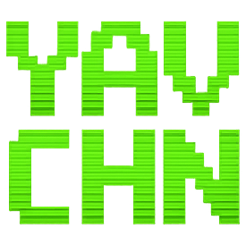
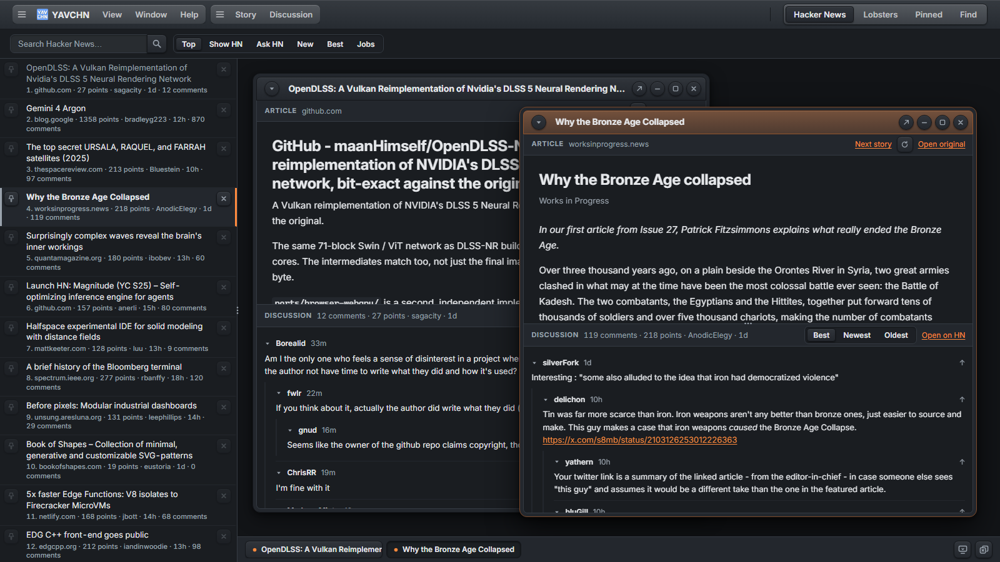

# YAVCHN - Yet Another Vibe-Coded Hacker News (Wrapper)



A desktop-style web reader for [Hacker News](https://news.ycombinator.com/) and [Lobsters](https://lobste.rs):

- **Left:** The list of stories from the active source
- **Right:** A window for each story you open, holding the linked article (reader-mode extracted) above its discussion thread

Why?

Because I could!

## No, Really... Why?

It seems that everybody has their own personalized Hacker-News reader these days. After all, why not? It's so easy to whip one up in an evening when you have agentic coding at your disposal.

Whenever I browse HN, I find myself opening the discussion in a new tab, then clicking through in that tab to view the article, then popping back to the discussion. It's all very annoying, when what I really want to do is get a quick overview of the article and see if there is any interesting discussion going on before I dive into either the article or the discussion.

YAVCHN lets me quickly browse an article in scaled-down reader mode with the discussion right below it, in the same window. If I find either one compelling, I can click "Open original" to see the original article or "Open on HN" / "Open on Lobsters" to join the discussion on the source's own site. Each story gets its own window, so I can open several, flip between them from the bar at the bottom, or drag two side by side to compare threads. "Next story" (or the `]` key) reads on down the list in the same window. When a comment links to another HN or Lobsters thread, that thread opens in a window too, and a link to a single HN comment opens the comment with its replies.

The same treatment works on [Lobsters](https://lobste.rs) (a smaller, computing-focused link aggregator) thanks to a tiny `Source` abstraction in the Go backend; pick the source from the segmented control at the right of the top bar. Switching sources or lists only swaps the list, so open windows stay put.

The YAVCHN menu also has an Applets submenu with three tools, each in a window of its own:

- **Replies to me** watches the replies to your Hacker News comments and stories, which HN itself never tells you about. Give it your user name and it checks every three minutes while it's open, marking what's new.
- **Look up a user** opens a Hacker News or Lobsters profile with the user's recent activity. Clicking a commenter's name in any discussion does the same.
- **Who is hiring?** filters the posts of HN's monthly hiring threads as you type: `remote rust -crypto "new york"`.

None of them needs a login. They read only what each site publishes for anyone to read.

The UI is built with [PUDL](https://github.com/paulmooreparks/pudl), my design language, and it borrows the window view of [parkscomputing.com](https://parkscomputing.com/).



## Live Site

The site is live at https://yavchn.parkscomputing.com/ if you'd like to try it out.

## Running Locally

```
go run ./src
```

Serves on `http://localhost:8080`.

## Stack

- Go 1.25, standard `net/http` + `html/template`.
- `golang.org/x/sync/singleflight`: coalesce concurrent upstream fetches.
- `github.com/hashicorp/golang-lru/v2/expirable`: bounded LRU + TTL for HN item and thread caches.
- `github.com/go-shiori/go-readability`: server-side article extraction.
- `github.com/microcosm-cc/bluemonday`: HTML sanitisation for extracted articles and comment bodies.
- `modernc.org/sqlite`: pure-Go SQLite for the article-extraction cache.
- [PUDL](https://github.com/paulmooreparks/pudl) v0.38.0 for the stylesheet, floating windows, menu bar, regions and splitters, copied from its release into `src/static/pudl/`.
- Vanilla JS for YAVCHN's own behaviour. No SPA framework.

## Design notes

- **The URL is king.** Every page in YAVCHN has its own URL. You can bookmark `/hn/show/`, `/lobsters/`, `/pinned/`, or a list with stories open, like `/hn/?open=hn-12345678,lobsters-abc123&top=hn-12345678`, and reopening that URL takes you straight back to what you were reading. The source, the tab, the page number, and every open window (which ones, which is in front, which are minimized, and where each one sits) all live in the URL, in PUDL's window grammar. Back undoes the last window you opened. Each story also has a page of its own at `/story/hn/12345678`, which is where its link goes without JavaScript. The older `/hn/s/12345678` addresses redirect to the story's window. Pinned's filters live in the URL too: `/pinned/?q=rust&source=lobsters&show=unread&sort=points` is Lobsters stories mentioning Rust that you haven't opened, by points. The pins themselves stay in your browser, so the server renders the filter controls from the URL and the browser applies them.

- **No accounts, no per-user server state.** YAVCHN never sees your HN or Lobsters credentials. Comments are fetched from each site's public JSON API and rendered into the discussion pane. When you want to vote, reply, save, or hide a comment, click the upward arrow next to it (or the "Open on HN" / "Open on Lobsters" link at the top of the pane). That opens the item on the source's own site in a new tab, where your existing session does the work.

- **Multi-source by design.** YAVCHN is built around a small Go interface called `Source` (see `src/source.go`). HN and Lobsters each have their own implementation that knows how to talk to their respective JSON APIs. Adding a third site means writing one more implementation. The rest of YAVCHN doesn't care which site a story came from.

- **Caching.** Story lists, individual items, and comment threads are cached in memory with a short time-to-live (a minute or two), so the front page doesn't hammer HN or Lobsters when many people are reading. Article extraction is much more expensive (fetch the source page, run readability, sanitize the HTML), so extracted articles are cached durably in SQLite and only re-fetched after 30 days.

- **Progressive enhancement.** The page renders fully server-side, so it works without JavaScript, and the server renders the windows the URL names along with the list. A window that opens later is fetched from `GET /window/{key}`, which returns that one window's markup. The article reader-mode pane and the comment thread are fetched separately after a window appears, via `GET /api/article` and `GET /api/discussion`. That keeps the first paint fast, and it lets the heavier requests fail without breaking the page. Visitors with JavaScript disabled see plainly-labeled "Open original" and "Open on HN" / "Open on Lobsters" fallback links instead.

- **Each story is a PUDL applet.** PUDL's applet runtime starts a story's script when its window opens and stops it when the window closes, so every window runs on its own. While a story's window is in front, the story puts a Story menu and a Discussion menu in the menu bar. It also reports its scroll positions and the comment you'd reached as its state, which YAVCHN keeps per story so a reload finds your place again. Closing a window forgets it, but a story that Next replaced keeps its place, for when Back returns to it.

- **Browser-local state.** The list width, the article's share of a window, theme choice, the hidden-list mode, pinned stories, dismissed stories, visited stories, collapsed comment threads, the comment-sort preference, the domain block-list, and your place in each story (its scroll positions and the comment you'd reached) all live in your browser's `localStorage`. Nothing is sent to the server. Small inline scripts apply your theme, the list width, the article split, and the hidden-list mode before the first paint, so reloading doesn't flash the default layout for a moment.

- **Search.** Search runs against HN only, at `/hn/search`. Lobsters has a search page, but it returns HTML rather than JSON, so instead of scraping that HTML and watching it break every time Lobsters tweaks its markup, YAVCHN returns 404 for `/lobsters/search`.

## Docker

```
docker build -t yavchn .
docker run --rm -p 8080:8080 yavchn
```

YAVCHN is a single-binary distroless image. The SQLite article cache is in `/home/nonroot/yavchn.db` inside the container and rebuilds from scratch after a container replace.

## License

[MIT](LICENSE). Feel free to use it, fork it, embed it, learn from it, whatever. Just keep the copyright notice intact.
